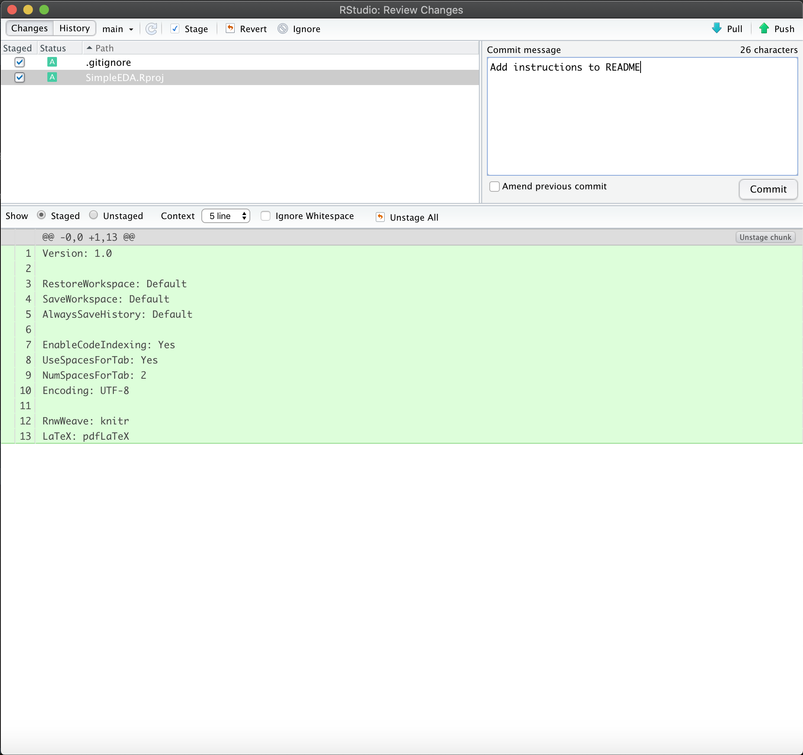

# SimpleEDA

## Instruction to set up Git:
1) Go to https://git-scm.com/downloads and download and install git
2) Go to github.com and create a new account
3) Follow the instructions at https://docs.github.com/en/free-pro-team@latest/github/setting-up-and-managing-your-github-user-account/setting-your-commit-email-address to set up your email address
4) Open the Terminal app on Mac or the Command Line app on Windows and type:
`git config --global user.name "<YOUR NAME>"` where `<YOUR NAME>` is replaced by
your name. This will be the name that gets attached to any commits that you write, 
and can either be your name or GitHub user name, based on your preference. 

## Importing the Project into RStudio
1) Click File -> New Project
2) Select “Version Control”
3) Select “Git”
4) For “Repository URL” type: https://github.com/jnbetancourt/SimpleEDA.git
5) For "subdirectory" choose the location on your computer where you want to store
the project files
5) There will be a prompt to enter your GitHub password
6) This should create a directory called `SimpleEDA` on your computer with the project files.

## Instructions to Push Changes to Git
1) Make changes to files in the SimpleEDA folder
2) In RStudio select Tools->Version Control->Commit
3) This will open a dialog box that lists all the files that you have made changes
to. Click the checkbox next to all of the files that you want to push changes for,
and type a short description of the changes that you made in the "Commit Message"
box.

4) Click the button that says "Commit"
5) Click the button that says "Pull"
6) If someone else has made changes to the same files as you, there will be a message saying
that there is a conflict. You can use that dialog to open a merge tool that allows you to
merge your changes with the ones on GitHub.
7) Click the button that says "Push"

